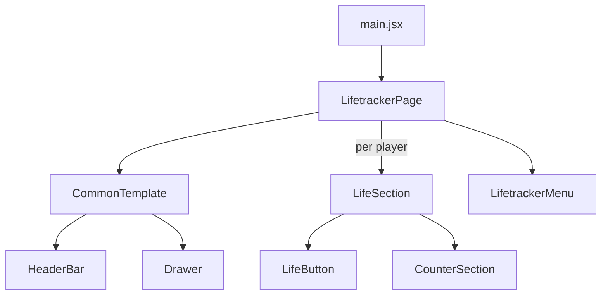

# Life Tracker App by Mike Slater

This is my first forray into a JS/React -> TypeScript convertsion. The original js repo is [here](https://github.com/slatron/life-tracker-ts/) 

[View JS App](https://slatron.github.io/life-tracker-ts/)

## App Features

Tracks life totals for 1 to 6 players. Each player has a main score and fourt control buttons in their life section. Each section also contains a coounter that can be used to track a value against a specific other player, such as special damage delt.

The UI can be put in "flip" mode. This rotates half of the players totals, making it easier to view if set in the middle of a play area.

## Component Tree

## Tech Used

- CSS/Sass
- React
- Vite
- github
- TypeScript